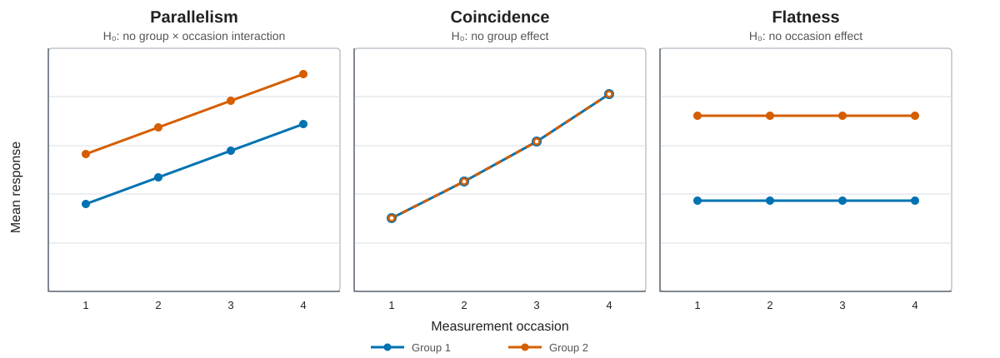

**Slides covered.** `BIOS-767-Part-001.pdf`, slides 28-36; `BIOS-767-Part-005.pdf`, slides 4-54; `BIOS-767-Part-006.pdf`, slides 4-23; `anova-refitting.pdf`, document pp. 1-5.

## Motivation and data structure

Classical repeated-measures methods target group, time, and group-by-time effects when all subjects share a small fixed visit grid. They provide exact finite-sample tests under strong covariance assumptions but are poorly suited to irregular time, substantial missingness, or continuous time effects.

Let $h=1,\ldots,H$ index group, $i=1,\ldots,n_h$ subject within group, and $j=1,\ldots,n$ measurement occasion (visit or time point). A **group** is a between-subject treatment, exposure, or other category; each subject belongs to exactly one group.

| Group $h$ | Occasion $j=1$ | Occasion $j=2$ | $\cdots$ | Occasion $j=n$ |
|---|---|---|---|---|
| $h=1$ | $\{Y_{1i1}:i=1,\ldots,n_1\}$ | $\{Y_{1i2}:i=1,\ldots,n_1\}$ | $\cdots$ | $\{Y_{1in}:i=1,\ldots,n_1\}$ |
| $h=2$ | $\{Y_{2i1}:i=1,\ldots,n_2\}$ | $\{Y_{2i2}:i=1,\ldots,n_2\}$ | $\cdots$ | $\{Y_{2in}:i=1,\ldots,n_2\}$ |
| $\vdots$ | $\vdots$ | $\vdots$ | $\ddots$ | $\vdots$ |
| $h=H$ | $\{Y_{Hi1}:i=1,\ldots,n_H\}$ | $\{Y_{Hi2}:i=1,\ldots,n_H\}$ | $\cdots$ | $\{Y_{Hin}:i=1,\ldots,n_H\}$ |

Each row is one group; within a row, the same $n_h$ subjects are followed across occasions.

## Univariate repeated-measures ANOVA

### Model and assumptions

The classical random-intercept formulation is

$$
Y_{hij}=\mu+\tau_h+\gamma_j+\eta_{hj}+b_{hi}+\varepsilon_{hij},
$$

with

$$
b_{hi}\stackrel{\mathrm{iid}}{\sim}N(0,\sigma_b^2),\qquad
\varepsilon_{hij}\stackrel{\mathrm{iid}}{\sim}N(0,\sigma_e^2),\qquad
b_{hi}\perp\varepsilon_{hij}.
$$

Therefore

$$
E(Y_{hij})=\mu_{hj}=\mu+\tau_h+\gamma_j+\eta_{hj},
$$

and, for $j\ne k$,

$$
\operatorname{Var}(Y_{hij})=\sigma_b^2+\sigma_e^2,\quad
\operatorname{Cov}(Y_{hij},Y_{hik})=\sigma_b^2,\quad
\operatorname{Corr}(Y_{hij},Y_{hik})
=\frac{\sigma_b^2}{\sigma_b^2+\sigma_e^2}.
$$

Thus the model implies compound symmetry: equal variances and a common nonnegative correlation. Time is categorical; its numerical spacing does not enter. *Slide source: `BIOS-767-Part-005.pdf`, slides 7-23.*

### Sphericity

Let $C$ be an $(n-1)\times n$ full-row-rank contrast matrix with $C\mathbf1_n=0$. Sphericity requires equal variances for all normalized within-subject contrasts:

$$
C\Sigma C^\mathsf T=\lambda I_{n-1}
$$

for an orthonormal $C$, equivalently $\operatorname{Var}(a^\mathsf TY)$ is constant over all unit-norm contrasts $a^\mathsf T\mathbf1_n=0$. Compound symmetry implies sphericity, but sphericity is weaker.

Sphericity supplies the common variance scaling needed for the usual univariate within-subject $F$ statistics to have their stated null $F$ distributions. It therefore permits valid Type I error control without estimating an unrestricted covariance matrix.

If sphericity fails, the usual within-subject $F$ tests can be anti-conservative: the actual probability of rejecting a true null can exceed the nominal level $\alpha$, so $p$-values may be too small. Greenhouse-Geisser or Huynh-Feldt corrections replace degrees of freedom $(\nu_1,\nu_2)$ by $(\widehat\epsilon\nu_1,\widehat\epsilon\nu_2)$, where

$$
\widehat\epsilon_{\mathrm{GG}}
=\frac{\{\operatorname{tr}(C\widehat\Sigma C^\mathsf T)\}^2}
{(n-1)\operatorname{tr}\{(C\widehat\Sigma C^\mathsf T)^2\}},
\qquad \frac1{n-1}\le\widehat\epsilon_{\mathrm{GG}}\le1.
$$

*Slide source: `BIOS-767-Part-005.pdf`, slides 41-42. The correction is identified there; the trace formula is the standard definition used by the software in the code companion.*

### Profile hypotheses

Let $M=(\mu_{hj})_{H\times n}$. Hypotheses are linear functions $C_BMU=0$, where $C_B$ contrasts groups and $U$ contrasts occasions.

- **Parallelism / no group-by-time interaction**

  $$
  H_0:C_BMU=0,\qquad
  \operatorname{df}=(H-1)(n-1).
  $$

- **Coincidence / no group effect**, assessed after parallelism:

  $$
  H_0:C_BM\mathbf1_n/n=0,\qquad
  \operatorname{df}=H-1.
  $$

- **Flatness / no time effect**, assessed after parallelism:

  $$
  H_0:\mathbf1_H^\mathsf TMU/H=0,\qquad
  \operatorname{df}=n-1.
  $$

{#fig-profile-hypotheses width="100%"}

*Slide source: `BIOS-767-Part-005.pdf`, slides 29-40.*

The exact $F$ ratios use distinct between-subject and within-subject error strata. Their expected-mean-square derivation is omitted in the slides; the result is stated on `BIOS-767-Part-005.pdf`, slides 35-40.

## Multivariate repeated-measures analysis

### Model

MANOVA (multivariate analysis of variance) jointly analyzes a vector of responses, whereas repeated-measures ANOVA analyzes a scalar response using a within-/between-subject decomposition and requires sphericity for its usual within-subject tests.

Treat each complete subject profile as a multivariate response:

$$
Y_i\sim N_n(M^\mathsf Ta_i,\Sigma),
$$

where $a_i$ encodes group membership and $\Sigma$ is the within-subject covariance matrix, with $\Sigma_{jk}=\operatorname{Cov}(Y_{ij},Y_{ik})$. The standard model assumes the same unrestricted $\Sigma$ for every subject and group: subjects may have different means through $a_i$, but their variance and correlation structure is assumed homogeneous. This common-$\Sigma$ assumption pools information across subjects; it is an assumption, not a mathematical necessity. MANOVA avoids sphericity but requires complete profiles on a common schedule and can lose power from estimating the $n(n+1)/2$ covariance parameters. *Slide source: `BIOS-767-Part-006.pdf`, slides 5-9.*

### Hypothesis and error matrices

For $H_0:C_BMU=0$, define

$$
H=(C_B\widehat MU)^\mathsf T
\{C_B(A^\mathsf TA)^{-1}C_B^\mathsf T\}^{-1}
(C_B\widehat MU),
$$

$$
E=U^\mathsf TY^\mathsf T
\{I-A(A^\mathsf TA)^{-1}A^\mathsf T\}YU.
$$

Let $\lambda_1,\ldots,\lambda_s$ be the nonzero eigenvalues of $E^{-1}H$. Then

$$
\begin{aligned}
\Lambda_{\mathrm{Wilks}}&=\frac{|E|}{|E+H|}
=\prod_{r=1}^s(1+\lambda_r)^{-1},\\
V_{\mathrm{Pillai}}&=\operatorname{tr}\{H(H+E)^{-1}\}
=\sum_{r=1}^s\frac{\lambda_r}{1+\lambda_r},\\
T_{\mathrm{HL}}&=\operatorname{tr}(E^{-1}H)=\sum_{r=1}^s\lambda_r,\\
\Theta_{\mathrm{Roy}}&=\lambda_{\max}.
\end{aligned}
$$

Each statistic is transformed to an exact or approximate $F$ reference distribution. Pillai is usually the most stable to assumption violations; Roy is most sensitive to a single dominant dimension. *Slide source: `BIOS-767-Part-006.pdf`, slides 11-16.*

## Estimation and inference workflow

1. Confirm a common planned visit grid and inspect missing profiles.
2. Fit the saturated group-by-visit mean.
3. For the univariate route, assess whether sphericity is defensible; report corrected tests when it is not.
4. For the multivariate route, report one prespecified statistic, usually Pillai or Wilks, rather than selecting by $p$-value.
5. Test parallelism first. Conditional follow-up questions are coincidence and flatness.
6. Use estimable contrasts for specific visit differences and adjust multiplicity when several are reported.

A Type III main-effect test compares adjusted marginal means for that factor, averaging over the levels of the other factor while retaining all other model terms, including the interaction. For example, the group main effect tests $C_BM\mathbf1_n/n=0$, and the occasion main effect tests $\mathbf1_H^\mathsf TMU/H=0$. A nonsignificant interaction does not require refitting merely to obtain the corresponding Type III main-effect test: Type III sums of squares are adjusted for the remaining terms. Refitting changes the model and may change residual variance; whether to refit is an estimand/modeling decision. *Slide source: `anova-refitting.pdf`, document pp. 1-5.*

## Interpretation

- A group-by-time rejection means at least one between-group contrast changes across occasions; it does not identify where.
- A time-effect rejection means the common/averaged profile is not flat, conditional on the tested model.
- A group-effect rejection means the parallel profiles differ by a constant vertical shift under the no-interaction model.
- Profile conclusions are occasion-specific; they do not imply a continuous-time trajectory between visits.

## When to apply

Use RM-ANOVA or repeated-measures MANOVA for balanced, complete, small fixed visit grids when categorical-time contrasts are the estimand. Prefer Gaussian marginal or mixed models for irregular times, incomplete profiles, time-varying covariates, heterogeneous covariance, or trajectory-based inference.
